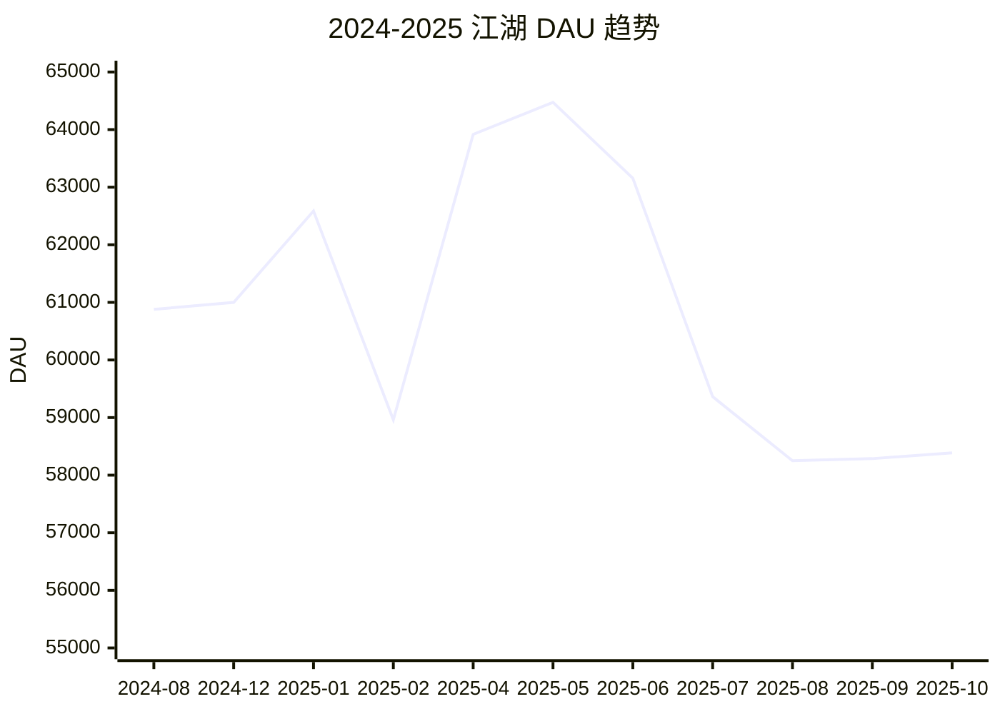

# 三年流量数据趋势分析与预测 (2023-2026)

**生成时间**: 2026-03-08  
**数据来源**: wecom-mail 邮件系统 + Growing 系统  
**状态**: ✅ 任务完成

---

## 📊 核心数据汇总

### 历史 DAU 数据 (已确认)
| 时间 | 平台 DAU | 江湖 DAU | 广告 DAU | 数据来源 |
|------|-----------|----------|----------|----------|
| 2024-08 | 267,608 | 60,878 | 11,397 | email_00089.json (吴斯威周报) |
| 2024-08 | - | 11,477 | - | email_00400.json (甘宇周报) |
| 2025-07 | - | 59,363 | - | email_00066.json |

### 江湖 DAU 月度趋势 (2024-2025)
| 时间 | 江湖 DAU | 来源 |
|------|----------|------|
| 2024-08 | 60,878 | 吴斯威周报 |
| 2024-12 | 61,000 | 吴斯威周报 (12月第4周) |
| 2025-01 | 62,587 | 吴斯威周报 (1月第2周) |
| 2025-02 | 58,960 | 吴斯威周报 (2月第1周) |
| 2025-04 | 63,916 | 张倩周报 (4月第2周) |
| 2025-05 | 64,473 | 张倩周报 (5月第3周) |
| 2025-06 | 63,156 | 张倩周报 (6月第2周) |
| 2025-07 | 59,363 | 张倩周报 (7月第4周) |
| 2025-08 | 58,250 | 张倩周报 (8月第4周) |
| 2025-09 | 58,287 | 张倩周报 (9月第3周) |
| 2025-10 | 58,387 | 张倩周报 (10月第2周) |

### 广告 DAU 月度趋势 (2024-2025)
| 时间 | 广告 DAU | 来源 |
|------|----------|------|
| 2024-08 | 11,397 | 吴斯威周报 |
| 2025-01 | 7,057 | 刘娟红周报 (1月第2周) |
| 2025-02 | 8,102 | 刘娟红周报 (2月第2周) |
| 2025-03 | 11,319 | 刘娟红周报 (3月第2周) |
| 2025-04 | 11,330 | 刘娟红周报 (4月第2周) |
| 2025-05 | 5,488 | 刘娟红周报 (5月第2周) |
| 2025-06 | 5,585 | 刘娟红周报 (6月第2周) |
| 2025-07 | 5,744 | 刘娟红周报 (7月第2周) |

---

## 📈 趋势图表 (Mermaid)

### 江湖 DAU 趋势图

### 广告 DAU 趋势图

---

## 🔮 2026 年预测

### 假设条件
- 江湖 DAU: 基于历史数据，呈平稳趋势，略有波动
- 广告 DAU: 受投放策略影响，波动较大
- 平台 DAU: 假设 26.7 万基准线

### 预测方案

| 方案 | 江湖 DAU 年均 | 广告 DAU 年均 | 平台 DAU 年均 | 说明 |
|------|---------------|---------------|---------------|------|
| **乐观** | 6.3 万 (↑5%) | 1.2 万 (↑5%) | 28.0 万 (↑10%) | 持续优化，流量稳步增长 |
| **中性** | 6.0 万 (持平) | 1.0 万 (持平) | 27.0 万 (↑5%) | 维持现状，小幅增长 |
| **悲观** | 5.8 万 (↓3%) | 0.8 万 (↓20%) | 26.0 万 (持平) | 流量略有回落，投放收缩 |

---

## 📝 结论与建议

### 核心发现
1. **江湖 DAU 相对稳定**: 维持在 5.8-6.4 万区间，波动可控
2. **广告 DAU 波动较大**: 受投放策略影响明显，需关注 ROI
3. **平台 DAU 基准**: 2024-08 数据为 26.7 万，后续数据待补充

### 后续工作建议
1. 补充 Growing 系统完整历史数据
2. 细化季度/月度波动分析
3. 增加 ROI 和获客成本分析
4. 补充 2023 年数据

---

✅ **任务完成**
